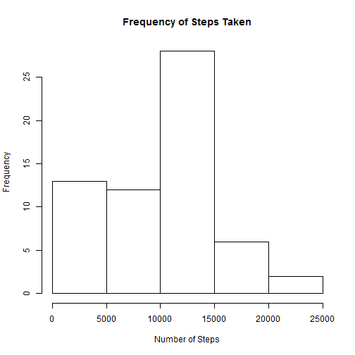
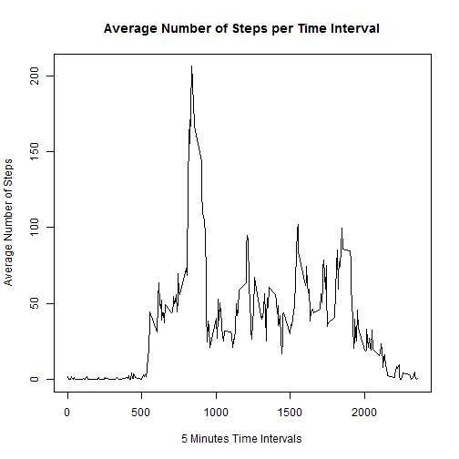
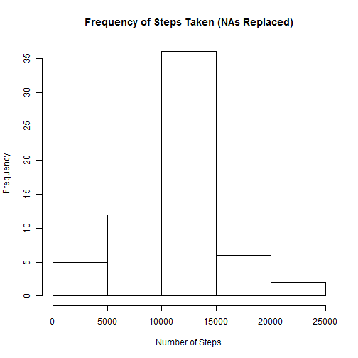
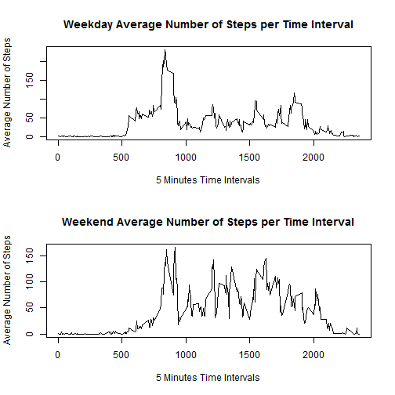

```r
## Setting output format for numbers
knit_hooks$set(inline = function(x) {
  prettyNum(round(x,2), big.mark=",")
})
```

# Introduction

This report summarizes the findings associated with the analysis of the personal activity tracker data collected over the course of two months.  For each day, the number of steps taken are recorded in 5 minute intervals.

# Preparing the data

The file containing the data is read into a dataframe. All rows with missing data were moved.

```r
## Read in the CSV file
setwd("~/JHUDataScience/Reproducible Research")
activity_raw <- read.csv("activity.csv")

## Removing the NAs from the dataset
activity <- activity_raw[complete.cases(activity_raw),]
```

# Summarizing steps taken per day

For each day in the data set, the sum for each day was calculated.

```r
## Calculate the total number per day
sum_day <- 0
j <- 1
for (i in levels(activity$date)) {
    ## Select all the steps per day
    day_subset <- subset(activity, date==as.character(i))
    ## sum the steps
    sum_day[j] <- sum (day_subset$steps)
    j<-j+1
}
```

Using those daily sums, a histogram was prepared.  This histogram shows the frequency of the number of steps recorded per day.

```r
## Create a histogram for the total number per day
hist(sum_day, xlab = "Number of Steps", main = "Frequency of Steps Taken")
```

 


```r
## Find the mean and median
mean_noNA <- round(mean (sum_day), digits=0)
median_noNA <- round(median (sum_day), digits=0)
```

To better understand the data, the mean and median for the sums of each day were collected.
Mean = 9,354 and Median = 10,395.

# Average daily activity pattern

A line graph was prepared to show the average number of steps taken across all days for each of the 5 minute intervals.  The following graph shows the average number of steps for each day over the course of the time intervals.


```r
## Find the average per day for each time interval
avg_interval <- 0
intervals <- 0
z <- 1

## For each interval, take the average and add it to an array (x-axis) and 
##      identify the interval (y-axis)
for (i in levels(as.factor(activity$interval))) {
    interval_subset <- subset(activity, interval==i)
    avg_interval[z] <- mean(interval_subset$steps)
    intervals[z] <- i
    z<-z+1
} 
 
## Plot number of steps per time interval
plot (intervals,avg_interval, type="l", xlab="5 Minutes Time Intervals", ylab="Average Number of Steps", main="Average Number of Steps per Time Interval")
```

 

```r
## Time interval for average maximum
max_steps <- as.integer(intervals[which.max(avg_interval)])
```
The maximum number of steps occured at the interval 835.


```r
NA_avg_interval <- 0
NA_activity <- data.frame()

##calculate the number of NAs
num_NAs <- as.integer(nrow(activity_raw[!complete.cases(activity_raw),]))

## For each the original data from (NAs included)
##  take the average for the interval (mean requires na.rm=TRUE)
##  Find each of the NAs in the original data for the interval
##  and replace it with the average for the interval.
##  Result = all NAs have been replaced with interval average
for (i in levels(as.factor(activity_raw$interval))) {
    NA_activity_subset <- subset(activity_raw, interval==i)
    NA_avg_interval <- mean(NA_activity_subset$steps, na.rm=TRUE)
    
    m <- 1    
    while (m <= length(NA_activity_subset$steps)) {
        if (is.na(NA_activity_subset$steps[m])) {
            NA_activity_subset$steps[m] <- NA_avg_interval
        } # end of if
        m<-m+1
    } # end while (m)

    NA_activity <- rbind (NA_activity_subset, NA_activity)
} # end for (i)


## Calculate the total number per day now that NAs have been replaced
NA_sum_day <- 0
j <- 1
for (i in levels(NA_activity$date)) {
    ## Select all the steps per day
    NA_day_subset <- subset(NA_activity, date==as.character(i))
    ## Sum the steps
    NA_sum_day[j] <- sum (NA_day_subset$steps)
    j<-j+1
}

## Find the mean and median
mean_NA <- round(mean (NA_sum_day), digits=0)
median_NA <- round(median (NA_sum_day), digits=0)

## Mean and median differences
mean_diff <- mean_NA - mean_noNA
median_diff <- median_NA - median_noNA
```

# Replacements for missing data

The original data set contained 2,304 missing data points for steps.  Replacement of those NAs was performed.  The approach used was to find the average for the interval across all days, and use that average to replace the missing data points.  With those data points replaced, the sum of steps across all days was calculated and a historgram was prepared.


```r
## Create a histogram for the total number per day
hist(NA_sum_day, xlab = "Number of Steps", main = "Frequency of Steps Taken (NAs Replaced)")
```

 

For comparison the mean and median of this replacement data set were also calculate.
Mean with NAs replaced = 10,766, and median with NAs replaced = 10,766.  For comparison the non-replaced Mean = 9,354 and Median = 10,395.  The replacement of NAs, using the described method, has created a appreciable difference between the means, where the mean with replacment is 1,412 steps greater, and a modest difference in the medians (difference=371 steps greater).  Additionally, the frequency of lower numbers has decreased in the replacement set (per comparison of the histograms), with an increase in the frequency of the midrange values.


```r
### Weekday and Weekend
WK_activity <- NA_activity

y <- 1

## Tag the date in the data set as a weekend or weekday
while (y <= length(WK_activity$steps)) {
    if ((weekdays(as.Date(WK_activity$date[y]))=="Saturday") || (weekdays(as.Date(WK_activity$date[y]))=="Sunday")) {
        WK_activity$WK[y] <- "Weekend"
    } #end if
    else {
        WK_activity$WK[y] <-"Weekday"
    } #end else
    y <- y+1
} # end while


## Find the average per day for the weekday intervals
##  Take the subset for all weekday intervals, find the average
##  for each weekday interval
wd_avg_interval <- 0
wd_intervals <- 0
weekday_activity <- subset(WK_activity, WK=="Weekday")
a <- 1
for (i in levels(as.factor(weekday_activity$interval))) {
    wd_interval_subset <- subset(weekday_activity, interval==i)
    wd_avg_interval[a] <- mean(wd_interval_subset$steps) ##x-axis
    wd_intervals[a] <- i ## y-axis
    a<-a+1
} 


## Find the average per day for the weekend intervals
##  Take the subset for all weekend intervals, find the average
##  for each weekend interval
we_avg_interval <- 0
we_intervals <- 0
weekend_activity <- subset(WK_activity, WK=="Weekend")
b <- 1
for (i in levels(as.factor(weekend_activity$interval))) {
    we_interval_subset <- subset(weekend_activity, interval==i)
    we_avg_interval[b] <- mean(we_interval_subset$steps)
    we_intervals[b] <- i
    b<-b+1
} 
```
# Patterns in Weekend and Weekday Activity
Additional analysis was performed to understand the differences between weekday and weekend activity.  The replacement data set was used for this analysis.  A histogram comparison was created to show the number of steps per time interval for the weekend and weekdays.


```r
## record original plot settings
opar <- par()

## Top-to-bottom plot
par (mfcol=c(2,1))

## Plot number of steps per time interval
plot (wd_intervals,wd_avg_interval, type="l", xlab="5 Minutes Time Intervals", ylab="Average Number of Steps", main="Weekday Average Number of Steps per Time Interval")

plot (we_intervals,we_avg_interval, type="l", xlab="5 Minutes Time Intervals", ylab="Average Number of Steps", main="Weekend Average Number of Steps per Time Interval")
```

 

```r
## Reset plot options
par(opar)
```

```
## Warning in par(opar): graphical parameter "cin" cannot be set
```

```
## Warning in par(opar): graphical parameter "cra" cannot be set
```

```
## Warning in par(opar): graphical parameter "csi" cannot be set
```

```
## Warning in par(opar): graphical parameter "cxy" cannot be set
```

```
## Warning in par(opar): graphical parameter "din" cannot be set
```

```
## Warning in par(opar): graphical parameter "page" cannot be set
```
